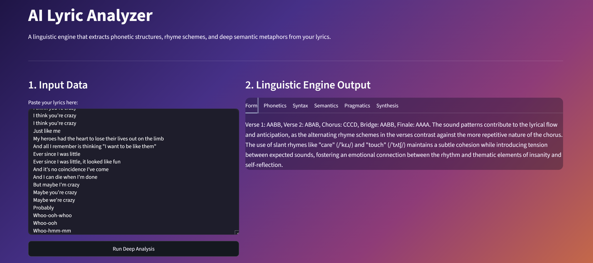

# AI Lyric Analyzer 🎵

> A simple linguistic lyrics analyzer: it pairs phonetic dictionary lookups with an LLM to break down a song's rhyme scheme, sound, syntax, meaning, and pragmatics.


## Live Demo
Experience the live application here: **[AI Lyric Analyzer Live App](https://lyric-analyzer-ysxpl53yrholdrzkbarzcr.streamlit.app/)**

---

## About the Project
Most automated lyric tools rely on basic sentiment counting or word clouds, missing the structural choices that make writing compelling. **AI Lyric Analyzer** looks at lyrics the way a close reader would: rhyme and sound, sentence structure, imagery, and what's implied but not said outright.

It looks up each line's end-word in the CMU Pronouncing Dictionary and converts that to IPA notation, then feeds those real phonetic transcriptions to an LLM alongside the lyrics so its rhyme-scheme and sound analysis is grounded in actual pronunciation data rather than guesswork. The phonetic lookup is English-only (CMU dictionary coverage), so analysis works best on English lyrics.



---

## Architecture & Technical Stack

The application relies on a hybrid pipeline architecture:
1. **Deterministic Phonetic Parsing (`pronouncing` + Python):** Before touching an LLM, the backend isolates end-words, strips punctuation, maps them to the CMU Pronouncing Dictionary, and converts the resulting ARPAbet phonemes into standard IPA notation (e.g., `/ˈkreɪzi/`) with correct syllable-level stress placement.
2. **Structured Data Validation (`Pydantic` + `Instructor`):** Enforces strict JSON data serialization, preventing conversational bloat and forcing the model into specific analytical pillars.
3. **Interactive Dashboard (`Streamlit`):** A responsive, multi-column dashboard featuring a custom gradient theme and tabbed navigation.

### Tech Stack:
* **Core Language:** Python
* **NLP & Linguistics:** `pronouncing`, `string` tokenization, ARPAbet-to-IPA phonetic conversion
* **AI & Validation:** OpenAI API (`gpt-4o-mini`), `instructor`, `Pydantic`
* **Frontend Dashboard:** Streamlit
* **Environment & Security:** `python-dotenv`, Git, Streamlit Cloud

---

## Analytical Pillars
The engine evaluates text across six tabs, each a distinct level of linguistic analysis, returned as a short, direct paragraph grounded in quoted lines from the lyrics and IPA-notated sounds (e.g., `/eɪ/`) rather than raw ARPAbet codes:
* **Form:** Strict end-rhyme notation (e.g., AABB, ABAB) backed by phonetic dictionary data, including slant rhymes, plus how the form drives momentum or expectation.
* **Phonetics:** Assonance, consonance, alliteration, and stress/meter patterns, and the effect they create (weight, softness, tension).
* **Syntax:** Line breaks vs. clause boundaries, coordination/subordination, ellipsis, and how sentence structure shapes pacing and tension.
* **Semantics:** Core motifs and conceptual metaphors, and how concrete imagery maps onto abstract emotional states.
* **Pragmatics:** Who the speaker is addressing, the dominant speech act (assertion, question, command, confession), and what's implied but not stated outright.
* **Synthesis:** The song's starting situation, turning point, and resolution (or lack thereof), tying the other five pillars together into its overall meaning.

---

## Local Installation & Setup

If you want to run or test this project locally on your machine:

1. **Clone the repository:**
   ```bash
   git clone https://github.com/imtalca/lyric-analyzer.git
   cd lyric-analyzer
   ```

2. **Create a virtual environment and install dependencies:**
   ```bash
   python -m venv venv
   venv\Scripts\activate   # Windows
   # source venv/bin/activate   # macOS/Linux
   pip install -r requirements.txt
   ```

3. **Configure your OpenAI API key:**
   Create a `.env` file in the project root:
   ```
   OPENAI_API_KEY=your_key_here
   ```
   > **Don't have a key?** If you're testing this project and don't want to set up your own OpenAI API key, contact me at contact@talcamusic.com and I can share one or run an analysis for you.

4. **Run the app:**
   ```bash
   streamlit run app.py
   ```
